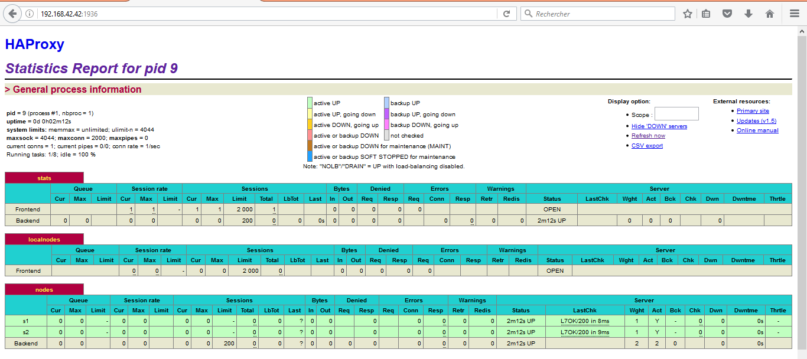
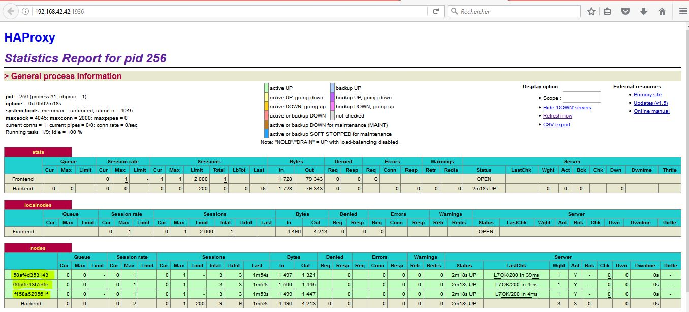
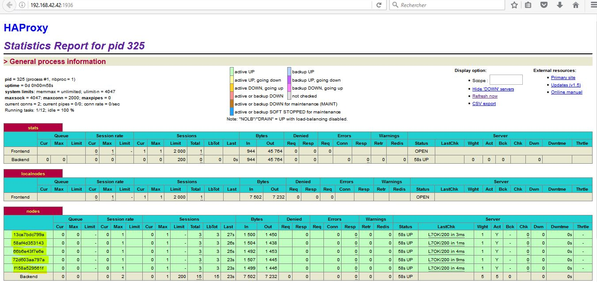
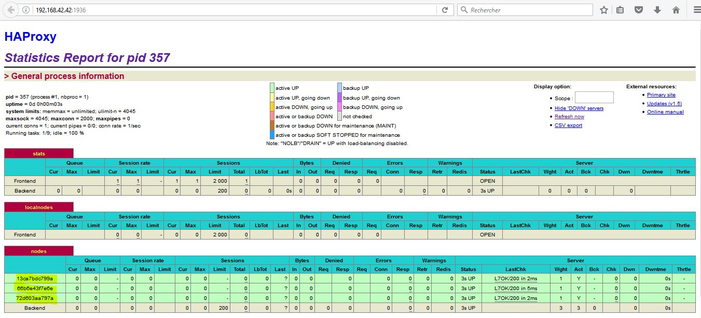

## Lab 04 - Docker
#### Auteurs: Sopie Noulala & Togue Kamga
---
#### Objectives:
At the end of this laboratory, we must be:

* Able to build our own Docker images

* Familiar with lightweight process supervision for Docker

*  Able to understand core concepts for dynamic scaling of an application in production

* Able to put into practice decentralized management of web server instances

#### Table of contents:

 - Introduction
 - Task 0
 - Task 1
 - Task 2
 - Task 3
 - Task 4
 - Task 5
 - Task 6
 - Difficulties
 - Conclusion

#### Introduction:
In this lab, we will find many solutions to solve problems encounter with the achitecture developped in the previous lab. The objectif is to reconfigure and generate configurations files automatically, and be able to add or remove as much as end nodes webb servers we want to our infrastructure without need to reconfigure the HAProxy.

#### Task 0: Identify issues and install the tools
**[M1] :** No we can use the solution of the previous lab in a production environment. Because in that solution, we cannot dynamically add and remove web servers. To achieve this we must reconfigure manually the HAProxy to inform it if a webb server is added or removed (crashed).   

**[M2] :**  **Description of the procedure to add new webapp container to the infrastructure of the previous lab:**  

 - Update files in the ``ha/scripts`` directory:
   * add the command ``sed -i 's/<s3>/$S3_PORT_3000_TCP_ADDR/g' /usr/local/etc/haproxy/haproxy.cfg`` in the ``run-daemon.sh`` and ``run.sh`` files
 - Update the ``ha/config/haproxy.cfg`` file: Add the command ``server s3 <s3>:3000 check``  
 - Rebuild the image of ha: ``cd /vagrant/ha``  
                            ``docker build -t softengheigvd/ha .``
 - Stop and force to remove the containers : ``docker rm -f s1 s2 ha``
 - Start the containers:
``docker run -d --name s1 softengheigvd/webapp``
``docker run -d --name s2 softengheigvd/webapp``
``docker run -d --name s3 softengheigvd/webapp``
``docker run -d -p 80:80 -p 1936:1936 -p 9999:9999 --link s1 --link s2 --link s3 --name ha softengheigvd/ha``    

**[M3] :** **Issues to the current solution**  
This solution is not good because we are doing update manually. The issue must be to do update automatically. Like we will do so far in this lab, we can write a script that will edit and run automatically the HAProxy when this one will be informed by a ``serf agent`` if a node is added or removed to the infrastructure.
 
**[M4] :** **Management of web app nodes**  
As we will see in **Task 5** of this lab, we can write two scripts ``join`` and ``leave``  that will generate a proper HAProxy configuration file.
 
**[M5] :**  
 With the current solution, it is not possible to run additional management processes beside the main web server / load balancer process in a container. Because the central tenet of the Docker design is the following principle ``One process per container``. The issue of this problem is to install a process supervisor.

  
**[M6] :**   
If we add more server nodes, we must also add more lines with the command ``sed`` in the ``run.sh`` script. For example, if we add server node s3, we must add line ``sed -i 's/<s3>/$S3_PORT_3000_TCP_ADDR/g' /usr/local/etc/haproxy/haproxy.cfg``in the ``run.sh`` script.
This solution is not dynamic. To solve this problem, we can use a template engine to easily generate configuration files like we will see in task 4 of this lab. 
 
**Deliverables**:  
#####1. Screenshot of the stats page of HAProxy :


#####2. URL of our repository: 

Our repository is [here](git@github.com:norahsopie/Teaching-HEIGVD-AIT-2016-Labo-Docker.git)

#### Task 1: Add a process supervisor to run several processes
**Deliverables**:  
#####1. Screenshot of the stats page of HAProxy at <http://192.168.42.42:1936>:


#####2. Objectives and difficulties of the task:
 Normally, there is only a single process running inside a container. Consequently, the container will run only when the process is running. This means that when the process stops, the container automatically stops as well. To solve this problem, we need to run several processes at the same time in a container. To achieve this, we need to have process supervisor. So we install an init system called ``s6`` in the Docker images of HAProxy and Web applications, and we configure it as our main process replacing the current one.
The problen here is that when doing this, we don't have no more applications. To remedy to this, we create a folder ``services`` in HAProxy and Webb applications where we copy the starting scripts for ``s6``, making the applications available again. We then copy these scripts in to the right pace in our Docker images and run them. 

#### Task 2:
**Deliverables**:

#####1. Docker log output for each of the containers `ha`, `s1` and `s2`:  
You will find in the directory ``logs/task_2`` files containing Docker log output of each container `ha`, `s1` and `s2`. Files ``ha_logs_i``, ``s1_logs_i`` and ``s2_logs_i`` contain output of docker log before creating Docker network. Files ``ha_logs_f``, ``s1_logs_f`` and ``s2_logs_f`` contain output of docker log after creating Docker network.   
#####2. Answer to the existing problem with the solution 
One problem here is the way we kill the serf agent, by trapping the **SIGTERM** and in place running the function that will kill the process.  
Also, in the current solution, all nodes created after the first node will attach to the cluster created by this first node through this one. For example, if we start ``ha`` first, then ``s2`` and finally ``s1``, ``ha`` will connect to itself as it is the first one and create a cluster, then ``s1`` and ``s2`` will join this cluster through ``ha``. The problem with this solution is that if ``ha`` leaves the cluster, all the nodes created after could not join the cluster since they can't see their reference node, and this is not normal because the cluster still exists with nodes ``s1`` and ``s2``.
The solution we propose is that since we are in a decentralized architecture, all news nodes created should reference the last node that have joined the cluster, and not the first node that create the cluster. Thus since this node have the ip address of the node that it refences, this last node can join it if the node it references has left the cluster and so on.
#####3. How serf work ?
Serf uses a ``gossip protocol`` to broadcast messages to the cluster.
Serf begins by joining an existing cluster or starting a new cluster. If starting a new cluster, additional nodes are expected to join it. New nodes in an existing cluster must be given the address of at least one existing member in order to join the cluster. The new member does a full state sync with the existing member over TCP and begins gossiping its existence to the cluster.  
**reference:** [here](https://www.serf.io/docs/internals/gossip.html)

#### Task 3:
**Deliverables**:

#####1. Docker log output for each of the containers `ha`, `s1` and `s2`:

You will find in the directory ``logs/task_3`` files containing Docker log output of each container `ha`, `s1` and `s2`. The file ``ha_logs_i`` contains Docker log output of ``ha`` after starting one backend node, and the file ``ha_logs_f`` contains Docker log output of ``ha`` after starting two backends nodes.

#####2. Logs from the `ha` container gathered directly from the `/var/log/serf.log`:   

You will find this output in the file ``ha_logs_inside``
#### Task 4:
#####1. Techniques to reduce docker images size
If in our docker file we have command line like:


     RUN command 1 
     RUN command 2
     RUN command 3
  or  
  ```
  RUN command 1 && command 2 && command 3
  ```  

It is preferable to use the second example, because if ``RUN command 1`` fails to execute, ``command 2`` and ``command 3`` wil not be executed.So this will facilitate the building of our image. But, in the first example, the execution of each command is independent of the execution of the previous one.      
To reduce the size of ours docker images, we can use ``docker-squash``.   
You can learn more [here](https://github.com/jwilder/docker-squash) 

#####2. Different approach to architecture our images to be able to reuse as much as possible what we have done. 
Maximize Your Docker Image Caching Techniques. You can learn more [here](https://www.ctl.io/developers/blog/post/more-docker-image-cache-tips/)
####3. Configuration files of HAProxy

All necessaries files are given in the directory: ``logs/task_4``

#####4. Problems of the configuration files
The configuration files just give informations about the last container that has joined the cluster. It erase the informations about the previous nodes that have joined the cluster. The problem is that we do not write after the contents of the file but we replace its contain with the new information. So we cannot have informations of all nodes in the cluster.
#### Task 5:
**Deliverables**:
#####1. Files `/usr/local/etc/haproxy/haproxy.cfg` generated in the `ha` container:
 - After running ha: ``logs/task_5/haproxy.cfg``
 - After running s1: ``logs/task_5/haproxy_s1.cfg``
 - After running s2: ``logs/task_5/haproxy_s2.cfg``
 - File containing output of ``docker ps``: ``logs/task_5/docker_ps``
 - File containing output of ``docker inspect``: ``logs/task_5/ha_inspect``, ``logs/task_5/s1_inspect``, ``logs/task_5/s2_inspect``
#####2. List of files from the `/nodes` folder inside the `ha` container:
  - File ``logs/task_5/list_of_nodes``
#####3. Configuration file after we stop s1:
 - File ``logs/task_5/ha_proxy_s1_stop``
#####List of nodes:
 - File ``logs/task_5/nodes_s1_stop``
#####File containing the ``docker ps`` output:
 - File ``logs/task_5/docker_ps_s1_stop``
#### Task 6:
**Delivrables**
#####1. Screenshot of HAProxy stat page showing 3 nodes



 - docker ps output file: ``logs/task_6/docker_ps_3_nodes_start``
#####Screenshot of HAProxy stat page showing 5 nodes



 - docker ps output file: ``logs/task_6/docker_ps_5_nodes_start``
#####Screenshot of HAProxy stat page showing 2 nodes ``s1`` and ``s2`` removed



 - docker ps output file: ``logs/task_6/docker_ps_2_nodes_remove``
##### 2. Comments about the final solution:
In this final solution, we have noticed that if we just have one back end node, the session id increment as we access and refresh the URL <http://192.168.42.42>. But if we have more than one node webb server, the session id doesn't increment, the requests are  forwarded to each node consecutivelly, but when the same request is forwarded again to the same node, its session id doesn't increment. And this is not normal. 
####Difficulties:
Referring to the Task 4, we didn't really find a different approach to architecture our images to be able to reuse as much as possible what we have done; That is reduces our image size and to build them fastly.

####Conclusion:
This lab was very instructive, since first of all it make us familiar with many docker commands (to build, run and stop containers), but from now, we are able to build an infrastructure with many processes running in a container by using a serf agent and configure automatically our HAProxy after avry events happening.